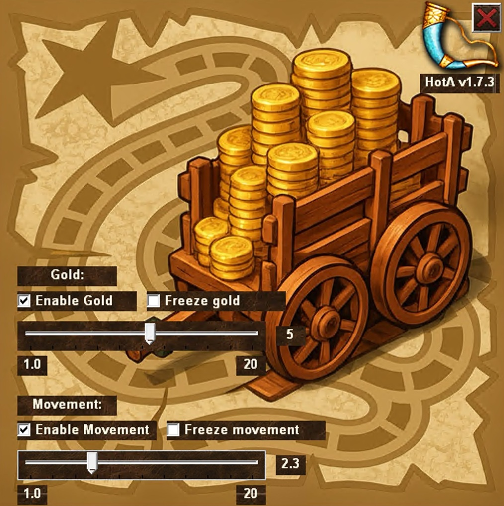

# Heroes 3 HotA Trainer

A trainer for Heroes of Might and Magic III - Horn of the Abyss, designed to make challenging custom maps more accessible.

## 📋 Description

This trainer was developed for personal use to help average players (like myself) tackle difficult G-maps such as **Crapcore** or **Flames of War**. These maps are known for their extreme difficulty and time-consuming nature, so this trainer helps balance the gameplay experience.

## ⚡ Features

### 💰 Gold Management
- **Increase gold income** by a custom multiplier (from 1.0 to 20.0)
- **Freeze current gold** - prevents gold spending
- Real-time enable/disable functionality

### 🚶 Hero Movement Management
- **Increase hero movement range** by a custom multiplier (from 1.0 to 20.0)
- **Freeze movement points** - preserves current movement range
- Precise adjustment using slider controls

## 🎮 Usage

1. **Launch the game or trainer** in any order
2. **Enable desired functions** using checkboxes
3. **Adjust multipliers** using sliders
4. **Freeze gold or movement** when needed

## ✅ Compatibility

- **Tested on:** HotA v1.7.3

## ⚠️ Notes

- Trainer is intended for single-player games
- Created to enhance gameplay experience on particularly challenging maps
- Not recommended for multiplayer games

## 🛠️ Technical Details

The trainer works by modifying in-memory game values, allowing real-time parameter changes without requiring game restarts.

---

*Created for Heroes 3 enthusiasts who want to enjoy challenging maps without excessive difficulty.*